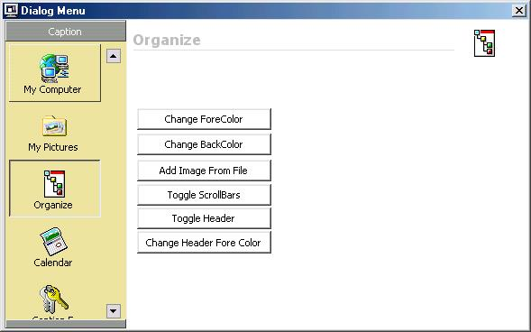



## Dialog Menu \(Updated\)

### Description

Update of the Usercontrol that emulates the menubar on the side of dialogs on system using the newest version of comctl32.ocx (I think). vbaccelerator image list is now built right in through a class, so there is no need to distribute his ocx (Steve mcMahon). Header and scrolling have been added to allow for a light emulation of an outlook menubar (only one bar though). Allows changing of backcolor, forecolor(text), Header Forecolor, Header Caption, and toggling of Scrollbar and Header Visibility. Also allows for images to be loaded from file and from a STDPicture object. If you are wondering why I went to such lengths to include the vbaccelerator image list in a class wrapper?? it supports color depths up to 32 bit, try that with the normal MS image list!!. All in all a nice control with a pretty small footprint.
 
### More Info
 

             |
---                |---
**Submitted On**   |2001-08-26 23:03:38
**By**             |[Ray Hildenbrand](https://github.com/Planet-Source-Code/PSCIndex/blob/master/ByAuthor/ray-hildenbrand.md)
**Level**          |Intermediate
**User Rating**    |3.3 (13 globes from 4 users)
**Compatibility**  |VB 4\.0 \(32\-bit\), VB 5\.0, VB 6\.0
**Category**       |[Custom Controls/ Forms/  Menus](https://github.com/Planet-Source-Code/PSCIndex/blob/master/ByCategory/custom-controls-forms-menus__1-4.md)
**World**          |[Visual Basic](https://github.com/Planet-Source-Code/PSCIndex/blob/master/ByWorld/visual-basic.md)
**Archive File**   |[Dialog Men253978262001\.zip](https://github.com/Planet-Source-Code/ray-hildenbrand-dialog-menu-updated__1-26679/archive/master.zip)

